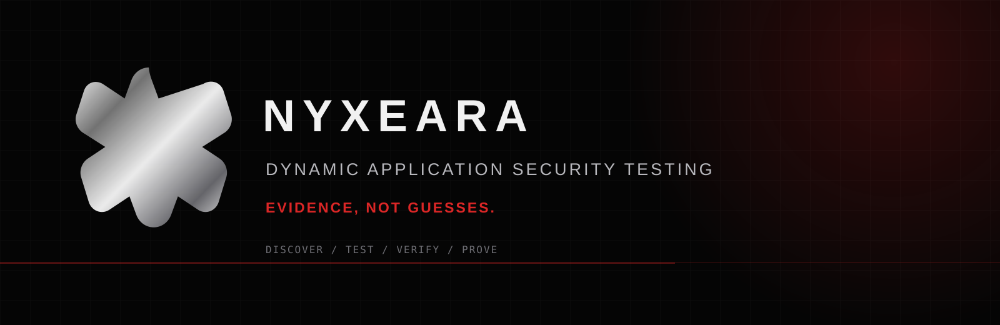

<div align="center">
  
  <h1>NYXEARA</h1>
  <p><strong>Dynamic Application Security Testing built for evidence, not guesses.</strong></p>
  <p>
    <a href="https://nyxeara.vip">Website</a> ·
    <a href="https://nyxeara.vip/docs">Documentation</a> ·
    <a href="https://nyxeara.vip/developers">Developer API</a> ·
    <a href="https://nyxeara.vip/security">Security</a>
  </p>
</div>



## What Nyxeara is

**Nyxeara is a dynamic application security testing (DAST) platform for live web applications.** It discovers attack surface, runs controlled security tests, verifies findings, and preserves the evidence needed to investigate what was actually observed.

The platform is built around a simple distinction: **a possible vulnerability is not the same thing as a verified finding.**

That principle shapes the product—from discovery and authenticated testing to verification, evidence integrity, investigation, and CI/CD delivery.

> **Discover → Test → Verify → Prove**

## Security testing, organized around evidence

| Surface | What Nyxeara provides |
|---|---|
| **Attack surface** | Crawling, endpoint discovery, technology intelligence, DNS intelligence, and shadow API discovery |
| **Dynamic testing** | Web application and API security testing across vulnerability families including SQL injection, XSS, SSRF, LFI, command injection, SSTI, CORS, open redirects, security headers, and information disclosure |
| **Authenticated testing** | Bearer tokens, cookies, JWT, OAuth, and session replay workflows |
| **Verification** | Finding lifecycle states and verification-oriented workflows designed to separate signal from assumption |
| **Evidence** | Raw request/response evidence, integrity hashing, content-addressed evidence, and redaction support |
| **Advanced testing** | WAF-aware payload variants, GraphQL testing, and OAST/callback-based verification |
| **Delivery** | CLI and API workflows, CI/CD severity gates, SARIF 2.1.0, signed webhooks, export, and reporting workflows |

Capabilities evolve. This repository deliberately documents the product at the level that can be supported rather than turning plans or internal experiments into marketing claims.

## The engineering model

Nyxeara separates the product identity from its internal scanning engine:

```text
Nyxeara
└── Vantage
    ├── discovery
    ├── crawling
    ├── dynamic security checks
    ├── authentication
    ├── verification
    ├── evidence
    └── analysis
```

**Nyxeara** is the product and platform. **Vantage** is the internal engine identity.

## Where it fits

### DAST

Test applications from the outside against running systems. Discover exposed functionality, exercise security checks, and retain the evidence behind meaningful results.

### Offensive security

Use a black-box workflow to examine the attack surface of web applications and APIs without requiring source-code access to the target application.

### Security research

Nyxeara is designed with a research mindset: observable behavior first, reproducible evidence second, conclusions after verification.

### Engineering

Move security findings into developer workflows through API access, CLI workflows, SARIF output, CI/CD gates, signed webhooks, and investigation-oriented evidence.

## Evidence is the product boundary

Security scanners can produce a large amount of output. Nyxeara is designed to make the important question harder to ignore:

**What exactly happened?**

A useful finding should be inspectable. That means preserving the relevant request and response, recording verification state, protecting evidence integrity, and giving investigators enough context to understand the result rather than simply accepting a severity label.

This is why Nyxeara's public language emphasizes **evidence, verification, and reproducibility** instead of raw finding counts.

## Responsible security

Nyxeara is intended for authorized security testing. Only scan systems you own or have explicit permission to test.

For vulnerability disclosures, see [`SECURITY.md`](SECURITY.md).

## Repository scope

This repository is the **flagship public Nyxeara repository**. It is intentionally separated from private infrastructure, deployment configuration, credentials, customer data, and other operational material.

The public repository should remain a trustworthy technical reference. Planned, experimental, private, or unverified capabilities are not presented as production features here.

## Explore Nyxeara

- **Product:** https://nyxeara.vip/
- **Capabilities:** https://nyxeara.vip/capabilities
- **Features:** https://nyxeara.vip/features
- **Documentation:** https://nyxeara.vip/docs
- **CLI documentation:** https://nyxeara.vip/docs/cli
- **Security:** https://nyxeara.vip/security
- **Developers:** https://nyxeara.vip/developers
- **Research / blog:** https://nyxeara.vip/blog

## Status

Nyxeara is actively developed. The public surface represents the capabilities that are appropriate to document publicly; internal roadmaps and private implementation details are intentionally excluded.

<p align="center">
  <strong>NYXEARA</strong><br />
  <sub>Dynamic Application Security Testing · Offensive Security · Security Research</sub><br />
  <sub><em>Evidence, not guesses.</em></sub>
</p>
